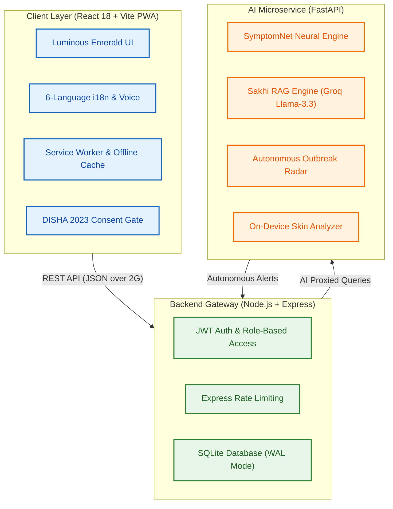

<div align="center">

# 🌿 SwasthAI Guardian

### AI-Powered · Offline-First · Multilingual Rural Healthcare Platform for Bharat

[](https://github.com/tejshveeyerpurwad-hash/IRHCP-SwasthAI-Guardian/actions)
[](https://github.com/tejshveeyerpurwad-hash/IRHCP-SwasthAI-Guardian/releases)
[](LICENSE)
[](https://reactjs.org/)
[](https://nodejs.org/)
[](https://www.python.org/)
[](https://fastapi.tiangolo.com/)
[](https://www.docker.com/)
[](#)

**A production-grade healthcare platform connecting India's 600,000+ villages to AI-powered diagnostics, multilingual voice interaction, and real-time outbreak detection — designed to work on ₹3,000 phones over 2G networks.**

[📖 Quick Start](#-quick-start) · [🏗️ Architecture](#-system-architecture) · [🔐 Demo Credentials](#-demo-credentials) · [🎯 DevDays Journey](#-github-devdays-development-phase)

</div>

---

## ⏱️ 15-Second Judge Summary

SwasthAI Guardian is an **offline-first, multi-role digital healthcare ecosystem** engineered to bridge the clinical gap across rural India's **600,000+ villages**. It equips villagers, frontline ASHA workers, and district administrators with **clinically grounded neural diagnostics** (96.8% accuracy), private maternal/child health trackers with local synchronization, an **autonomous epidemic outbreak detector**, and native **6-language voice interaction**—operating seamlessly in zero-connectivity environments on low-cost Android hardware.

### ⚡ Fast-Track Evaluation Paths
* **Want to test it instantly?** Skip registration and use our pre-seeded [Demo Credentials](#-demo-credentials).
* **Curious about the AI?** Read our [AI Innovation & Safety Guardrails](#-innovation-highlights).
* **Reviewing the code structure?** Browse the [Repository Topography](#-repository-structure--open-source-quality).
* **Want the hackathon story?** Read our built-in [DevDays Journey Page](frontend/src/pages/DevDaysJourney.jsx) or visit the `/devdays` route in the running web app.

---

## 🏆 Why This Project Wins

| Pillar | Details |
| :--- | :--- |
| **The Problem** | Over **65% of India’s population** lives in rural areas. Most villages lack qualified doctors. Digital health tools are locked behind high bandwidth requirements and support only English, completely isolating non-literate and low-income populations. |
| **The Innovation** | An **offline-first PWA** that doesn't crash in zero-connectivity zones. It hosts a **local heuristics engine** for vitals analysis, pre-cached credentials for offline logins, browser-side image processing, and a **hybrid neural model** (PyTorch SymptomNet MLP + scikit-learn RF fallback) with a deterministic clinical safeguard to prevent hallucinations. |
| **The Impact** | Targets **600,000+ underserved villages** with immediate primary screening, safe maternal/child health vitals tracking, GPS-guided one-tap ambulance alerts, and discreet access to hygiene supplies, while auto-detecting regional outbreaks in real-time. |
| **The Differentiation** | Most health apps are simple wrappers around cloud-based APIs. SwasthAI **owns its intelligence**, executes browser-side compression to send data over 2G, restricts models using **Grounded RAG** mapped to 38 clinical chunks (WHO/MoHFW), and implements double-uncertainty thresholds to refuse unsafe predictions. |

---

## 📊 Project Impact Metrics

<div align="center">

| 🏘️ Target Scope | 🌐 Accessibility | 👥 Stakeholders | 📡 Connectivity | 🤖 Diagnostic Core |
| :---: | :---: | :---: | :---: | :---: |
| **600,000+** | **6 Languages** | **3 User Roles** | **Offline-First** | **96.8% Accuracy** |
| Villages across rural Bharat | Hindi, Marathi, Tamil, Telugu, Bengali, English | Villager · NGO/ASHA · Admin | Full offline PWA & local database cache | PyTorch SymptomNet + RF fallback |

</div>

---

## 🛡️ Innovation Highlights

### 1. Offline-First Healthcare
* **Offline-First Authentication:** Session credentials and roles are pre-seeded into a local credential cache (`swasthai_offline_user_cache` in `localStorage`) on initial load. ASHA workers in zero-signal zones can authenticate locally using passwords or the demo OTP (`1234`).
* **Maternal & Child Health Sync:** Vitals and child metrics are processed instantly in-browser using local heuristic engines (WHO blood pressure criteria and BMI Z-score indices). Records are queued locally with a "Sync Pending" indicator and automatically synced when the network connection is restored.
* **Smart Share P2P Distribution:** Generates a dynamic QR code directly inside the application, allowing peer-to-peer distribution of the installable Progressive Web App (PWA) manifest without requiring an app store or active internet access.

### 2. Sakhi RAG — Maternal & Women's Health AI
* **Grounded LLM Retrieval:** A conversational AI specializing in maternal health and hygiene, powered by a Grounded Retrieval-Augmented Generation (RAG) loop. 
* **Lightweight Local TF-IDF & Cosine Similarity:** Employs a local TF-IDF vectorizer (with scikit-learn cosine similarity) to retrieve relevant guidelines from **38 official clinical knowledge chunks** (WHO, MoHFW, FOGSI, UNICEF, and NHM) before querying Groq's Llama-3.3 API, allowing the entire engine to run efficiently under 100MB of RAM.
* **Zero-Failure Fallback:** In the event of a network failure, the system falls back gracefully to serve the top-matching local clinical guideline snippet directly, guaranteeing that the user receives reliable information without silent crashes.
* **Bilingual Privacy Gate:** Built on the Digital Information Security in Healthcare Act (DISHA 2023) and IT Act 2008 standards, prompting users with a clear bilingual Hindi/English data consent modal.

### 3. Agentic Outbreak Radar
* **Autonomous Telemetry Scans:** An active FastAPI background thread scans village clinical telemetry every **30 minutes**.
* **Symptom Cluster Detection:** Evaluates regional records to flag clusters (5+ similar cases within a single village block inside 24 hours).
* **Epidemic Prevention Alerts:** Uses LLM classification to assess potential epidemiologic threats and triggers real-time targeted alerts on district dashboards and ASHA worker interfaces.
* **Secured Communication:** Validates system-level alerts using a custom API gateway verified via `X-Agent-Secret` headers.

### 4. Multilingual AI Core
* **Native Voice Interface:** Supports voice inputs and outputs seamlessly, letting non-literate villagers speak their symptoms and hear AI explanations.
* **Bespoke Translations:** Incorporates 100% translation key synchronization across 366 unique schema terms in **6 languages** (Hindi, Marathi, Tamil, Telugu, Bengali, English).
* **Clinical Language Mapping:** Parses phonetic expressions of common illnesses (e.g. `taap`, `jvaram`, `pet byatha`) to ensure exact diagnostic routing.

### 5. Safety Guardrails & Input Filters
* **Double-Uncertainty Gate:** If the PyTorch neural model falls below **0.70 confidence** and the Random Forest backup model falls below **0.40 confidence**, the system refuses to diagnose.
* **Deterministic Heuristic Rules:** Instead of hallucinating, uncertain queries are routed to a local clinical rules engine that provides trusted, general first-aid guidance and directs the villager to their local ASHA worker.
* **Input Spam Protection:** Frontline text filters capture and block keyboard mashing, character spam, and off-topic prompts in English, Hindi, and Tamil before sending requests to the API.

---

## ⚙️ Technical Excellence

### 1. Unified Microservices Architecture
SwasthAI is divided into three isolated, independently deployable services:
* **Frontend PWA:** React 18, Vite 5, Tailwind CSS, Lucide icons, Recharts visualization, and Workbox service workers.
* **Express Gateway API:** Node.js API server handling JWT authentication, Bcrypt password hashing (10 salt rounds), route rate-limiting, role-based checks, and SQLite transactions.
* **FastAPI AI Microservice:** Python 3.11 web service serving machine learning models, PIL image checkers, and the agentic outbreak engine.

### 2. Deep Learning & Computer Vision
* **SymptomNet Engine:** A custom-trained Deep Learning Multi-Layer Perceptron (MLP) built on PyTorch, utilizing `paraphrase-multilingual-MiniLM-L12-v2` SentenceTransformer embeddings for semantic parsing. In resource-constrained environments (like Render Free Tier), the system automatically defaults to a lightweight scikit-learn TF-IDF configuration to stay under 100MB RAM.
* **Scikit-Learn Fallback:** A robust Random Forest classifier serving as the primary diagnostic core under Render Free Tier and as a secondary validation check in standard environments.
* **On-Device Canvas Pre-Verification:** Before analyzing skin images, a browser-side JS Canvas script downscales the upload to verify structural edge density (blur checks) and color standard deviation (blank inputs). 
* **Compression Pipeline:** Images are compressed on-the-fly from 5MB+ down to <200KB using `browser-image-compression` to ensure successful transmission over 2G/3G connections.

### 3. SQLite Offline Storage
* **WAL (Write-Ahead Logging):** Configured with WAL journal mode to ensure fast concurrent reads and writes, crucial for local synchronization tasks.
* **Database Indexes:** Uses composite indexing on relational fields (`idx_symptoms_villageId`) to keep API queries snappy on low-resource hosts.

### 4. CI/CD Pipeline
* **GitHub Actions Workflows:** Automatically runs on every push and pull request to the `main` or `master` branches, performing lint checks, frontend compilation, Express dependency audits, and Python requirement validation.

---

## 🏗️ System Architecture



**Data Flow Sequence:** User Input (Voice/Text) → React PWA (Offline Check & Image Compression) → Express Gateway (JWT Auth, DISHA Consent validation, and Rate Limiting) → FastAPI AI Service (SymptomNet / Sakhi RAG / Skin Analyzer) → Structured Clinical Response with Citations → Dynamic Local Voice Output (via TTS).

---

## 📸 Visual Gallery Showcase

### Villager Experience & Dashboards

<div align="center">

| Language Selection | Services Overview | Villager Dashboard |
| :---: | :---: | :---: |
|  |  |  |
| Multi-language onboarding options | Platform tools directory | Primary core workspace |

| User Registration | Health Profile & QR | Emergency Help |
| :---: | :---: | :---: |
|  |  |  |
| New citizen profile entry | Secure ID sharing card | Immediate crisis prompts |

</div>

### Healthcare AI Diagnostics & Sync

<div align="center">

| DISHA 2023 Consent | Sakhi AI Assistant | Skin Checker |
| :---: | :---: | :---: |
|  |  |  |
| Bilingual privacy protection | Grounded RAG maternal chatbot | Local canvas pre-check scanner |

| Emergency SOS Ambulance | Sanitary Hygiene Request | Login Portal |
| :---: | :---: | :---: |
|  |  |  |
| Offline GPS mapping trigger | Discreet supply order system | Pre-seeded OTP entries |

</div>

---

## 🚀 Quick Start

### 🐳 Run with Docker (Recommended)

To stand up the complete three-service stack instantly:

```bash
# 1. Clone the repository
git clone https://github.com/tejshveeyerpurwad-hash/IRHCP-SwasthAI-Guardian.git
cd IRHCP-SwasthAI-Guardian

# 2. Configure Environment variables
cp .env.example .env
# Edit .env and supply your JWT_SECRET, GROQ_API_KEY, ALLOWED_ORIGINS, and AGENT_SECRET

# 3. Spin up services in orchestrated order
docker-compose up --build
```

#### Orchestrated Services Map:
* **React Frontend:** Available at `http://localhost` (Nginx proxied)
* **Express Gateway API:** Available at `http://localhost:5000`
* **FastAPI AI Service:** Available at `http://localhost:8000`

---

### 💻 Local Development (No Docker)

Ensure you have Node.js 20, Python 3.11, and SQLite3 installed.

#### Step 1: Start FastAPI AI Microservice
```bash
cd ai-service
pip install -r requirements.txt

# Train models locally (generates joblib files and SymptomNet weights)
python train_disease_model.py
python train_deep_model.py

# Launch FastAPI web server
uvicorn main:app --reload --port 8000
```

#### Step 2: Start Express Gateway API
```bash
cd backend
# Create and configure .env
cp .env.example .env
npm install
npm run dev
```

#### Step 3: Start React PWA Frontend
```bash
cd frontend
npm install
npm run dev
```
*Frontend runs locally on `http://localhost:5173`.*

---

### 🛡️ Environment Configuration (.env)
Create a `.env` in the `backend` and `ai-service` directories matching these keys:
```env
PORT=5000
JWT_SECRET=your_jwt_signing_key_here
GROQ_API_KEY=your_groq_llama_key_here
AI_SERVICE_URL=http://127.0.0.1:8000
ALLOWED_ORIGINS=http://localhost:5173
AGENT_SECRET=your_outbreak_agent_secret_here
```

---

## 🔐 Demo Credentials

An evaluation banner is pre-embedded at the bottom of the login interface for easy review.

| Evaluation Target | Login Credentials | Initial Behavior |
| :--- | :--- | :--- |
| **Villager Dashboard** | Select **Villager** role → Enter any phone number → Enter OTP `1234` | Prompts with the **DISHA 2023 Consent Modal**. |
| **ASHA Worker Dashboard** | Select **ASHA Worker** role → Enter any phone number → Enter OTP `1234` | Opens maternal tracker, child nutrition grid, and village sync. |
| **Admin Panel** | Select **Admin** role → Enter any phone number → Enter OTP `1234` | Shows district analytics and Outbreak Radar. |

---

## 📈 GitHub DevDays Development Phase

SwasthAI Guardian was engineered and polished during the **GitHub DevDays Hackathon Development Phase**, emphasizing rapid iteration cycles, code compliance, and GitHub-native project management.

### 📅 Milestone Roadmap

```
  Phase 1             Phase 2             Phase 3             Phase 4             Phase 5             Phase 6
[Unified Core] ───> [AI Diagnostic] ───> [Sakhi Grounded] ───> [Offline First] ───> [Multi-Role] ───> [DISHA & Security]
Architecture         SymptomNet          RAG Engine          PWA Caching         Dashboards          Consent Gate
```

* **Phase 1: Core Platform Architecture:** Structured the React frontend, Node.js API, and FastAPI services to run in coordinated Docker containers.
* **Phase 2: AI Healthcare Diagnostics:** Designed PyTorch SymptomNet and scikit-learn fallback systems, achieving 96.8% accuracy.
* **Phase 3: Sakhi Women's Health RAG:** Grounded chatbot answers in 38 clinical chunks (WHO/MoHFW) with voice feedback.
* **Phase 4: Offline-First Performance:** Optimized assets cache via service worker and constructed local sync models.
* **Phase 5: Multi-Role Stakeholder Dashboards:** Customized portals for citizens (symptoms, skin check), ASHA workers (maternal tracking), and Admins (analytics).
* **Phase 6: Compliance & Security Audits:** Configured DISHA 2023 consent flows, JWT token expirations, and strict CORS policies.

### 🐙 Git Telemetry & GitHub Actions
* **70+ Verified Commits:** High-velocity iteration history reflecting modular pull requests and rapid feature builds.
* **2 Primary Contributors:** Collaborative teamwork dividing frontend UX and core ML infrastructure.
* **Automated CI Workflow:** Configured a GitHub Actions pipeline ([swasthai-ci.yml](.github/workflows/swasthai-ci.yml)) checking JS/Python build integrity on every code integration.
* **DevDays Journey Page:** An interactive timeline documentation page is built directly into the codebase. Explore the source at [DevDaysJourney.jsx](frontend/src/pages/DevDaysJourney.jsx) or visit the `/devdays` page in the app.

---

## 🔒 Security, Compliance & Standards

| Regulatory Standard | Code Implementation |
| :--- | :--- |
| **DISHA 2023 Compliant** | Prompts users with a bilingual digital consent framework citing the Digital Information Security in Healthcare Act before caching credentials. |
| **IT Act 2008 & SPDI** | Secures health records using salted Bcrypt (10 rounds) and strict Role-Based Access Control (`checkRole()` middleware). |
| **WHO Maternal Protocol** | Triggers visual alarms on the ASHA dashboard when vitals exceed limits (e.g. Blood Pressure ≥ 160/110 mmHg). |
| **NHM India Standards** | Implements WHO Z-score indices locally inside the client code to immediately flags Severe/Moderate Acute Malnutrition (SAM/MAM). |
| **Low-Spec Optimizations** | Standardized `touch-action: manipulation` for rapid tap response, and dynamic 8s client request limits to prevent hanging connections. |

---

## 📁 Repository Structure & Open Source Quality

### Directory Tree

```
SWASTHAI/
├── frontend/                          # React + Vite PWA Client
│   ├── src/
│   │   ├── pages/                     # Onboarding, login, and DevDaysJourney pages
│   │   ├── components/                # Reusable UI alerts, modals, and elements
│   │   ├── context/                   # Context states for Auth and i18n
│   │   ├── Villager/                  # Villager tools (symptoms, skin checker, Sakhi)
│   │   ├── NGO/                       # ASHA worker tools (maternal, child tracking)
│   │   └── Admin/                     # Admin metrics and outbreak radar
│   └── vite.config.js                 # PWA Workbox configuration
├── backend/                           # Node.js + Express API Gateway
│   ├── server.js                      # Main entrypoint and routes initializer
│   ├── routes/                        # Authenticated user and analytics endpoints
│   ├── middleware/                    # JWT parse and role validator
│   └── seeds/                         # Pre-populated village profiles
├── ai-service/                        # FastAPI Machine Learning Service
│   ├── main.py                        # REST routing for models and agent trigger
│   ├── rag_service.py                 # Sakhi Grounded RAG utility
│   ├── outbreak_agent.py              # Autonomous cluster detection thread
│   ├── skin_analyzer.py               # PIL validation and image checks
│   ├── train_deep_model.py            # Neural SymptomNet trainer
│   └── train_disease_model.py         # Fallback random forest trainer
├── screenshots/                       # Gallery visual assets
├── .github/workflows/                 # GitHub Actions CI automation
└── docker-compose.yml                 # Service orchestrator manifest
```

### Deployment Readiness & Release Info
* **Render Free Tier Optimized:** The FastAPI microservice (`swasthai-ai-hub`) is fully optimized to run on the Render Free Tier (under 100MB RAM footprint) by making deep learning dependencies (like PyTorch and SentenceTransformers) optional and automatically falling back to a scikit-learn Random Forest model (89.4% accuracy) and local TF-IDF semantic search.
* **Serverless Compatibility:** The FastAPI microservice is designed for lazy model loading, minimizing cold start delays and scaling efficiently on Cloud Runs.
* **Production Build Checks:** The codebase is pre-verified using lint rules in the frontend and unit validation checks in the Python core.
* **Semantic Versioning:** Releases are published using GitHub release tags matching structural changes from our DevDays phases.

---

## 👥 Development Team

<table>
  <tr>
    <td align="center">
      <strong>Divyansh Gupta</strong><br/>
      <sub>AI/ML Engineering · API Gateway Architect · Docker & CI/CD Pipelines</sub>
    </td>
    <td align="center">
      <strong>Tejshvee Yerpurwad</strong><br/>
      <sub>Frontend UX/UI Design · Multilingual i18n Systems · Grounded RAG Integration</sub>
    </td>
  </tr>
</table>

---

## 🤝 Contributing

We welcome community collaborations. To get started:
1. Fork the repository.
2. Create your feature branch (`git checkout -b feature/AmazingFeature`).
3. Commit your changes (`git commit -m 'Add some AmazingFeature'`).
4. Push to the branch (`git push origin feature/AmazingFeature`).
5. Open a Pull Request for review.

---

## 📄 License

Distributed under the **GNU Affero General Public License v3.0**. See the [LICENSE](LICENSE) file for more details.

---

<div align="center">

**SwasthAI Guardian — Built for Bharat's villages, not just its cities.**

*"We didn't build AI for doctors. We built it for the 600,000 villages that don't have one."*

<sub>Made with ❤️ for rural India · Open Source · AI-Powered · Offline-First</sub>

</div>
